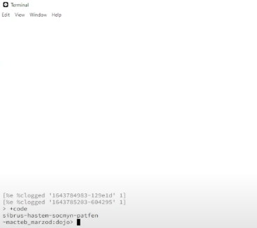
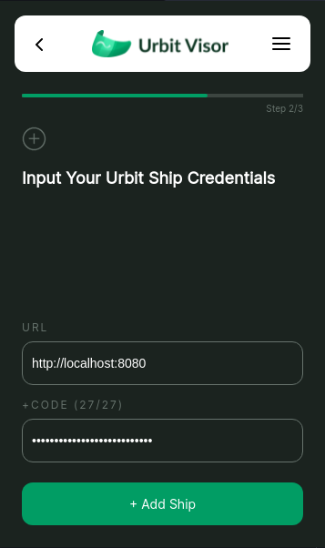
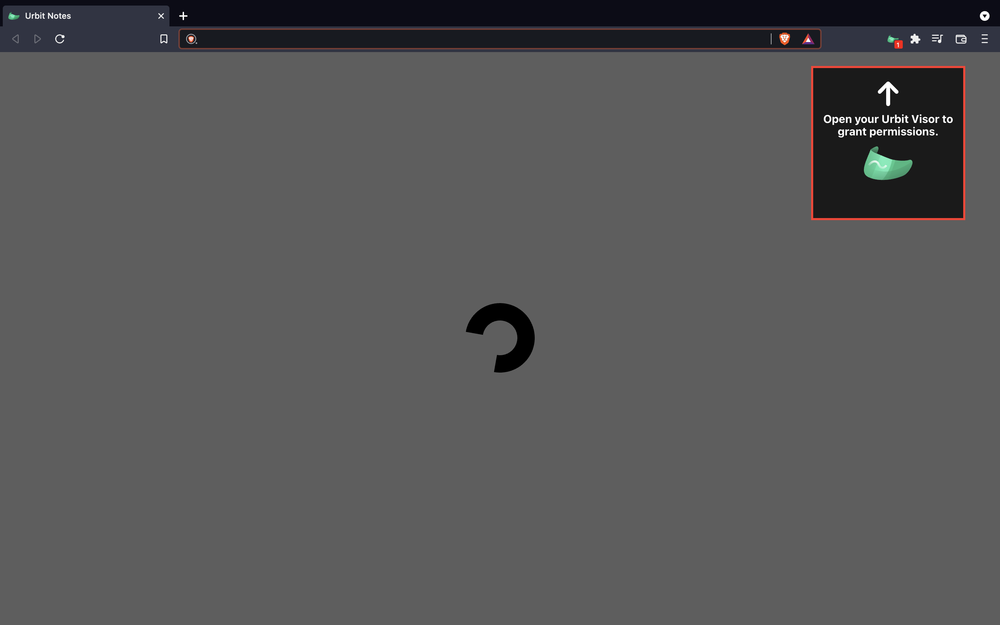
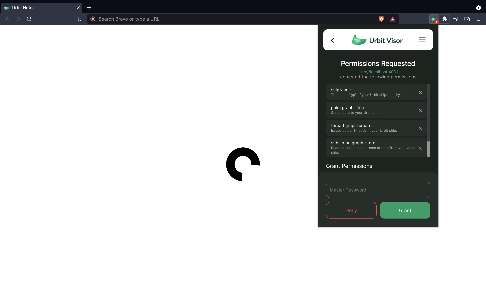
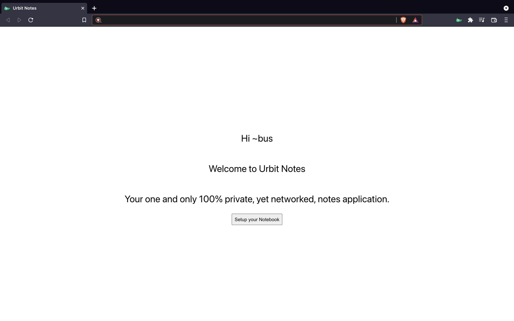

# Building Urbit Web Apps - Developer Guide

Many developers who first hear about Urbit get excited for the amount of underlying potential which lays within. An always-on server which can act as a persistant-global data store, packed with native identity, p2p messaging, and a full computation stack.

However one of the key problems getting into the Urbit ecosystem as a developer is just how much one needs to learn to even dip their toe in. Having to understand what Arvo or vanes are, learning hoon, understanding how gall agents work, and more on a long laundry list of "essentials" to get you started.

Though this has been the path of entry into the ecosystem up to this point, Urbit Visor was made precisely to provide an alternative option that simplifies the onboarding process for new devs by multiple orders of magnitude. It provides web developers all the power and convenience of Urbit while using the strengths and availability of the battle-tested web platform.

In this guide we'll build a simple note-taking web app using React (with hooks, on the most recent style) and TypeScript. Urbit Visor works with any Javascript setup of your choice, so feel free to use your preferred stack once you finish and understand the basic concepts.

This guide will teach you how to interact and use Urbit Visor inside of your app, not teach you how to use React or how to style your application with CSS. We expect basic JS/TS proficiency in this guide.

You can find the final source code of the project that you will build in this guide at: https://github.com/dcspark/urbit-notes/webapp.

## Setting Up Urbit Visor

To get started first you need to go [install Urbit Visor](https://chrome.google.com/webstore/detail/urbit-visor/oadimaacghcacmfipakhadejgalcaepg) from the Chrome Webstore, or compile it yourself ([instructions](https://github.com/dcSpark/urbit-visor)).

Once you've installed Urbit Visor in your local browser (any Chromium-derived browser like Chrome, Brave or Opera will work),
make sure you have an Urbit ship (personal server) running. Any Urbit ship works, local or remote, real or fake (used for development), from comets to galaxies.

Learn more about setting up your own Urbit ship [with this getting started guide](https://urbit.org/getting-started).



With your ship up and running, you simply need to acquire the `+code` password at the dojo/port/web terminal (by typing `+code` and copying the response), and use that + your ship's IP to add it inside of Urbit Visor.



Now that you have your ship added to Visor, you have access to the exact same unified API that every one of your users will. We are going to be treating the user's Urbit ship as a seamless dev ops free backend that is personalized to each user, without any extra work on the developer's side.

With all of that basic setup out of the way, let's get developing.

## Creating Your Project

To reiterate, Urbit Visor is framework agnostic. You can use it in whatever project you desire as long as you can import javascript dependencies.

Existing apps already exist using React and Svelte, but any other framework, or even vanilla JS should work fine. This guide will assume you are building a React app, but the general logic does not change much at all no matter what you're using.

To improve the developer experience, Urbit Visor exposes a few TypeScript types for type safety. In this guide we will be using TypeScript, so if you're not, just ignore the type annotations.

As mentioned earlier, we will be creating a simple note-taking Urbit web app which will be called `urbit-notes`. Let's create the base boilerplate for your project using `create-react-app`:

```bash
npx create-react-app urbit-notes --template typescript
```

To enable Urbit Visor functionality in your app you need to install the library `@dcspark/uv-core`. If you use npm, go to your app folder, and run

```bash
npm i --save @dcspark/uv-core
```

This will install and save the `@dcspark/uv-core` library.

Now let's open `App.tsx` and start building the webapp.

## Integrating With Urbit Visor

### Importing `urbitVisor`

To start, you will need to import the `urbitVisor` object at the top of the file.

```tsx
import { urbitVisor } from "@dcspark/uv-core";
```

Note that `urbitVisor` is just an object which includes a bunch of functions. It is not a `Class` that you have to initialize. You simply need to call one of the `urbitVisor` object's functions whenever you need to fetch or pass data to the Visor. You can check out [the Github page](https://github.com/dcSpark/urbit-visor) for details on all the functions exposed by the object.

### Importing Types

You can also import types from the core library by doing:

```tsx
import type { Permission, Scry, Poke } from "@dcspark/uv-core";
```

Now let's see how the initial setup process works.

## Permissions

One of the key parts of Urbit Visor is _permissions_. These permissions ensure that there is a firewall between the web and your Urbit ship to control who has access to what kind of data. Your Urbit server is forever, and people can and do hold vast amounts of sensitive data inside them, so you want to be careful there. That's one of the core needs that Urbit Visor was designed to address.

The permission system of Urbit Visor is still evolving, and will get more granular and sophisticated over time. As of present (version 0.3.3), Urbit Visor exposes six types of permissions, which are defined in the `Permission` type.

```tsx
export type Permission =
  | "shipName"
  | "shipURL"
  | "scry"
  | "thread"
  | "poke"
  | "subscribe";
```

`shipName` and `shipURL` are fairly easy to understand. `shipName` allows a webapp to fetch the name of the ship currently connected to the Urbit Visor (ex. ~zod), `shipURL` exposes the URL that you use to access your ship. If your ship is on local, that would be `http://localhost`. If your ship is hosted remotely, that's the URL that you use to access the Grid interface (and through it Landscape, etc.).

The other four permissions are a bit more technical. Let's go through them one by one.

## The Four Basic Urbit Actions

Urbit is a "clean-slate OS" which rearchitectured the stack from the ground up, from it's VM bytecode to its networking protocol. It is of course a Turing-complete computer, so it can run any code you write for it, but some of the concepts can be unfamiliar at first and take a bit to get used to. Let's take a look at the four basic actions:

[Scries](https://urbit.org/docs/arvo/concepts/scry) are requests to fetch data. In HTTP they map to GET requests.

[Subscriptions](https://urbit.org/docs/arvo/concepts/subscriptions) are long-running connections to a resource. Subscriptions don't immediately return data, instead, on a pub-sub pattern, they open an EventSource (i.e. Server-side Events) connection, and the Urbit ship will send data your way whenever there is an update to the resource you subscribed to.

[Pokes](https://urbit.org/docs/userspace/gall-guide/6-pokes) are the basic way to send data to an Urbit ship. They are a bit special though, in HTTP terms they are PUT requests, and they don't return data. A poke is a one-off request, which then may (or may not) trigger some update on the app it was sent to, which would then be sent by the subscription wire (to Visor, the pub-sub EventSource connection). So a common pattern is to subscribe to a certain app, poke it with new data, and then listen to the events sent through that subscription.

[Threads](https://urbit.org/docs/userspace/threads/overview) are a distinct type of Urbit action, used usually to enable async functionality which is harder to do in normal Urbit apps. In what concerns Urbit Visor, `thread` calls are POST requests which send json data in the body and usually return json data back. Threads may potentially trigger further changes that would be sent through the subscription wire.

We will see each action in more detail as we use them in this app.

## Initial boilerplate

The first thing a developer must do when importing Urbit Visor is declare what permissions the app will need. There's a variety of ways to do that (see details at [the Visor Github page](https://github.com/dcSpark/urbit-visor/)) but the recommended way to organize your permissions logic is by calling the `urbitVisor.require` function.

`require` takes two arguments, one an array of `Permission`, which we just saw above.
The second argument is a callback function which will be called once the Visor has made sure the required permissions are available.
Best practice is to define a function (call it e.g. `setData` or `setUrbitData`) to set all the initial data you want to collect, (e.g. the ship name, maybe some subscription) and pass it to `urbitVisor.require` alongside the list of permissions your app will need.

So let's do this in our `urbit-notes` app. On `App.tsx` we will add the following to the `useEffect()` function, so the Urbit Visor initial setup is run when the app mounts.

```ts
urbitVisor.require(["shipName"], setData);
```

That is all we need. This will make sure that every time the app is launched, Urbit Visor is asked for the required permissions, and if they have already been granted, the `setData()` function is run, collecting all the data we need at once.

So this brings us to the next obvious question. What do we put inside the `setData()` function?

Let's start with something simple.

```ts
const [ship, setShip] = useState("");
function setData() {
  urbitVisor.getShip().then((res) => setShip(res.response));
}
```

This makes it so your app declares a variable `ship`, which is first an empty string. Once the app is launched, Urbit Visor will be queried for the ship name, using the `getShip()` function of the `urbitVisor` object. If permissions don't exist, the request will fail, and Urbit Visor will show you a popup asking you to grant permissions. If permissions do exist, the ship name will be fetched and populate the `ship` variable.

Let's edit the initial boilerplate that `create-react-app` provides to see how this works in practice.

```tsx
import "./App.css";
import { useState, useEffect } from "react";
import { urbitVisor } from "@dcspark/uv-core";
import type { Permission } from "@dcspark/uv-core";

function App() {
  const [ship, setShip] = useState("");
  useEffect(() => {
    urbitVisor.require(["shipName"], setData);
  }, []);

  function setData() {
    urbitVisor.getShip().then((res) => setShip(res.response));
  }

  return (
    <div className="App">
      <header className="App-header">
        {ship && <p>Hi ~{ship}</p>}
        <p>Welcome to Urbit Notes.</p>
        <p>your one and only 100% private, yet networked, notes application.</p>
      </header>
    </div>
  );
}
export default App;
```

Save the `App.tsx` file and run your app. If your Urbit Visor has no ship connected, your app will prompt you to connect a ship.



If a ship is connected, you will get a prompt to give permissions to your app. It's the first time we run it so of course you don't have any permission. Click on the Urbit Visor extension icon to grant permissions.



Once you grant permissions, the app will start automatically. You should get something like this:



Congratulations, you have successfully used UrbitVisor to fetch data from a running Urbit server.

## Designing the app

As we mentioned, this example app is going to be called Urbit Notes. It's a simple note taking app that will use `graph-store`, the database used by the Groups (aka Landscape) app in Urbit to save chat, notebook and collection data. Our app will use Urbit Visor to make a personal notebook, writes notes, edit them, and of course read them.

The app will be running externally on a web2 server, but all data will be hosted in your own Urbit ship. Ever heard of Web3? The Decentralized Web? Well this is what it's all about.

Complete control of your data. Only really feasible on Urbit. And no gas fees to boot! But we digress, let's go back to the code.

As we mentioned there's two primary actions we need to perform in this app. Read data, and write data. In Urbit terms that means we need to `scry` and `poke`.

While not strictly necessary for this simple app, we will also `subscribe` to data so we can get an update sent to us once the data has been written to disk, and to show how subscriptions work with Urbit Visor. We will also call a `thread` for some complex functionality already implemented on `graph-store`.

Moving forward, let's change the permissions required for Urbit Notes:

```tsx
useEffect(() => {
  urbitVisor.require(
    ["shipName", "scry", "subscribe", "poke", "thread"],
    setData
  );
}, []);
```

Now we have added all of the permissions we are going to need to enable the full functionality of the app. If you run your app again (via `npm start`) you will see that Urbit Visor will prompt you to grant the permissions which you newly added. Authorize the permissions on your end.

Let's now edit the `setData()` function to set up the notebook in which we will write/save our notes on the Urbit ship.

But before we get there, first we need to make sure that the notebook channel exists, so we can go straight to the app or show a Welcome Screen to newcomers. To do this we will fetch all of the Landscape channels to which our ship is subscribed to, and check if the Notes notebook already exists.

To do that we are going to perform a `scry`.

## Scries

Fro mehre we'll declare a function, `checkChannelExists`, to check whether our notebook channel exists already. First of all we'll `scry` the list of all channels our ship is subscribed to, and log them to the console.

```ts
function setData() {
  urbitVisor.getShip().then((res) => {
    setShip(res.response);
    checkChannelExists();
  });
}
function checkChannelExists() {
  urbitVisor.scry({ app: "graph-store", path: "/keys" }).then((res) => {
    if (status === "ok") console.log(res.response["graph-update"].keys);
  });
}
```

Notice, we have added a call to the `urbitVisor.scry` function.
`urbitVisor.scry` call takes one argument, an object with two attributes, `app` and `path`.

```ts
interface Scry {
  app: GallAgent;
  path: Path;
}
```

`app` is the app, or in Urbit parlance, the Gall agent you are requesting data from.

`path` is the "scry path", the internal way that Urbit defines how to branch out data requests. Scry paths look similar to URL or unix file paths, as a series of words separated by forward slashes (or `fas` as we say in Urbit) e.g. `"/one/two/three/"` or `/graph/~dopzod/urbit-help/`.

Every app defines its own scry paths (aka endpoints), so check out the documentation of the Gall agents you will be using to make sure what paths are available.

In this case we are scrying the `/keys` path of the `graph-store` app. Every scry endpoint will produce a different data structure. In the case of `graph-store/keys` it returns an object with one key, `graph-update`. Inside of this object, it includes another object with one key, `keys`, whose value is an array of keys (see the type defined above); one for each channel your ship is subscribed to.

## Note On Error Handling

All `urbitVisor` functions that move data from and to your Urbit ship are of course async, and return promises. You can use `async-await` or `then().catch()` or `Promise.all()` or whatever it is your preferred pattern.

Visor requests can of course fail, either because of network errors, in which case the Promise might be rejected, or because of some issue Urbit-side (perhaps due to a malformed request). Every Urbit Visor response will return an object with a `status` key and a `response` key. Good responses will return `status: "ok"`, while bad responses will return `status: "error"`. You can do error handling by matching on the responses as:

```ts
if (res.status === "ok") handleSuccess(res.response);
else if (res.status === "error") handleError(res.response);
```

Now that we have the list of channels we can check if our Urbit Notes notebook is amongst them. Let's declare a new state variable, `registered`, and change its value according to whether `keys` contains our notebook or not.

```ts
  interface Key{
    name: string // the name of the channel, in kebab-case.
    ship: string // the ship that hosts the channel
  }
  const [registered, setRegistered] = useState(false);
  function checkChannelExists(){
    urbitVisor.scry({app: "graph-store", path: "/keys"}).then(res => {
      if (status === "ok") {
        const keys: Key[] = (res.response["graph-update"].keys);
        if (keys.find(key: Key => key.ship === ship, key.name === "my-urbit-notes") setRegistered(true));
        else createChannel();
      }
      else handleKeyScryError();
    });
  };
```

We added some logic to our `checkChannelExists` function to see whether the notebook exists already.

Our Notebook is a `Key` object with our ship as the host, and "my-urbit-notes" as the channel name. If the `keys` array that we scried from your Urbit ship already contains our notebook, it will set the `registered` variable as `true`. That's rather unlikely at this stage though, as we haven't created the channel yet. The `if` statement will evaluate to `false`, which will call the `createChannel()` function.

To create a channel we need to dive into another Urbit concept, the `thread`, so let's get to it.

## Threads

Threads are in fact one of the more complex parts of Urbit apps, but as it so happens creating a `graph-store` personal channel is also quite complicated to do yourself without threads. As such for this next step we'll have to look into how to call a `thread`.

`graph-store` channels all must belong to groups, so to create a personal channel you must first create a group, then a channel inside that group. One of the uses of threads is to chain multiple actions into one single function call and get one single result once they're all done. The developers at Tlon made the `add-graph` thread that simplifies the process of creating `graph-store` channels.

In HTTP terms, `threads` are POST requests, which pass a json body to your Urbit ship in the request and get a json body back in the response. Let's call `urbitVisor.thread` and create a channel for our Notebook.

```ts
interface Thread {
  threadName: string; // name of the channel
  inputMark: string; // json to hoon conversion mark for the thread request body
  outputMark: string; // hoon to json conversion mark for the thread response body
  body: any; // request body
}
async function createChannel() {
  const body = {
    create: {
      resource: {
        ship: `~${ship}`,
        name: "my-urbit-notes",
      },
      title: "My Urbit Notes",
      description: "My Awesome Private Urbit Notebook",
      associated: {
        policy: {
          invite: { pending: [] },
        },
      },
      module: "publish",
      mark: "graph-validator-publish",
    },
  };
  urbitVisor
    .thread({
      threadName: "graph-create",
      inputMark: "graph-view-action",
      outputMark: "json",
      body: body,
    })
    .then((res) => {
      if (res.status === "ok") checkChannelExists();
      else handleThreadError();
    });
}
```

`urbitVisor.thread` takes one argument, an object with four keys. `threadName` is the name of the thread you are calling. Next are `inputMark` and `outputMark`. [Marks](https://urbit.org/docs/arvo/clay/marks) in Urbit are files with instructions about how to convert data structures to different format. Urbit Visor of course passes json data around, but Urbit native data structures have their own format. Marks tell your Urbit ship how to convert (or text, or any data type you define) to the native Hoon data structure that the Urbit app or thread is expecting.

Threads both send and receive data from an Urbit ship, so you need both an input mark, that defines how to translate the request body json into something that Urbit will understand, and an output mark, which defines how to translate the result of your thread into json that your browser can read.
In the case of the `graph-create` thread, it expects the `graph-view-action` mark for input data, and the more generic `json` mark for the body output.

The thread `body` will depend on which thread you are calling. As we are calling `graph-create`, we are passing all the data necessary to create a new channel: the channel name (which must be a URL safe string in kebab-case), the channel type (or 'module', 'publish' refers to notebooks, 'chat' to chat rooms, 'link' to collections), etc. `graph-store` data structures are rather complicated, as we will see during the guide.

As it happens, the `create-graph` thread only returns `null`, so as long as the `urbitVisor.thread` function returns `status: "ok"` we can safely assume the channel was created successfully, so we'll call `checkChannelExists()` again to confirm.

You have now created your channel and can now proceed moving forward with reading and writing notes.

## End of initial flow

We now have all of the initial code in place for a note writing app.

To progress forward, we must first ask Urbit Visor for the necessary permissions. From there we will check if our Urbit server contains the notebook that the app will use as its backend datastore. If it doesn't exist, we will create the notebook.

After that, we have to add some code to display the contents of the notebook when the app runs. And while we're at it, we'll add a spinner which displays while the data is loading, and some simple error handling on top.

Adding all of these features in `App.tsx` will look as follows:

```tsx
import "./App.css";
import { useState, useEffect } from "react";
import { urbitVisor } from "@dcspark/uv-core";
import Notebook from "./Notebook";
import Spinner from "./Spinner";

function App() {
  const [ship, setShip] = useState("");
  const [loading, setLoading] = useState(true);
  const [registered, setRegistered] = useState(false);
  const [error, setError] = useState("");
  const spinner = (
    <Spinner width={100} height={100} innerColor="white" outerColor="black" />
  );

  useEffect(() => {
    urbitVisor.require(["shipName"], setData);
  }, []);

  function setData() {
    urbitVisor.getShip().then((res) => setShip(res.response));
  }

  interface Key {
    name: string; // the name of the channel, in kebab-case.
    ship: string; // the ship that hosts the channel
  }
  function checkChannelExists(ship: string) {
    urbitVisor.scry({ app: "graph-store", path: "/keys" }).then((res) => {
      setLoading(false);
      if (res.status === "ok") {
        const keys: Key[] = res.response["graph-update"].keys;
        if (
          keys.find(
            (key: Key) => key.ship === ship && key.name === "my-urbit-notes"
          )
        )
          setRegistered(true);
      } else handleKeyScryError();
    });
  }
  function handleKeyScryError() {
    setError("Scry failed");
  }
  function handleThreadError() {
    setError("Thread failed");
  }
  interface Thread {
    threadName: string; // name of the channel
    inputMark: string; // json to hoon conversion mark for the thread request body
    outputMark: string; // hoon to json conversion mark for the thread response body
    body: any; // request body
  }
  async function createChannel() {
    const body = {
      create: {
        resource: {
          ship: "~zod",
          name: "my-urbit-notes",
        },
        title: "My Urbit Notes",
        description: "My Awesome Private Urbit Notebook",
        associated: {
          policy: {
            invite: { pending: [] },
          },
        },
        module: "publish",
        mark: "graph-validator-publish",
      },
    };
    urbitVisor
      .thread({
        threadName: "graph-create",
        inputMark: "graph-view-action",
        outputMark: "json",
        body: body,
      })
      .then((res) => {
        if (res.status === "ok") checkChannelExists();
        else handleThreadError();
      });
  }

  if (loading)
    return (
      <div className="App">
        <div className="loading">{spinner}</div>
      </div>
    );
  else if (!registered)
    return (
      <div className="App">
        <header className="App-header">
          {ship && <p>Hi ~{ship}</p>}
          <p>Welcome to Urbit Notes</p>
          <p>
            Your one and only 100% private, yet networked, notes application.
          </p>
          {!ship && (
            <button className="create-button" onClick={createChannel}>
              Connect your Urbit Visor
            </button>
          )}
          {ship && (
            <button className="create-button" onClick={createChannel}>
              Setup your Notebook
            </button>
          )}
          {error && <p className="error-message">{error}</p>}
        </header>
      </div>
    );
  else
    return (
      <div className="App">
        <Notebook ship={ship} />
      </div>
    );
}
export default App;
```

## Writing Notes

Now that we have finished the initial user onboarding flow, we will progress by creating a new component, `Notebook`. This component will render the contents of the notebook in the user's ship (where all the notes will be stored) for the user to be able to view and edit in our web app.

Note: Type annotations are getting complicated so we'll move them to the `types.ts` file, which you can check in this Github repo.

```tsx

import "./App.css";
import { useState, useEffect, useReducer } from "react";
import { urbitVisor } from "@dcspark/uv-core";
import type { Graph, Post, Content, TextContent } from "./types";
import Spinner from "./Spinner";

interface NotebookProps {
  ship: string; // ship name
}


function Notebook(props: NotebookProps) {
  const [posts, setPosts] = useState<Graph>({});
  const [loading, setLoading] = useState(true);
  const spinner = (
    <Spinner width={40} height={40} innerColor="white" outerColor="black" />
  );

  useEffect(() => {
    urbitVisor.scry({
      app: "graph-store",
      path: `/graph/~${props.ship}/my-urbit-notes`,
    }).then(res => {
      setPosts(res["graph-update"]["add-graph"]["graph"])l
      setLoading(false);
    }
  }, []);

  return (
    <div className="notebook">
    <header> My Urbit Notes </header>
    </div>
  );
}
export default Notebook;

```

As you may have noticed at this point what we don't have yet are the notes themselves. Our brand new, private, networked Urbit notebook is still empty. Let's remedy that and start writing notes.

## Pokes

To write a note we'll need to learn about `pokes`. In the Four Basic Urbit Actions section we mentioned that _pokes_ are the basic method of sending data to an Urbit ship (akin to a POST request).

To add new notes to the Urbit notebook, we'll need to send data to `graph-store`. To do that we need to send a command with a json body that specifies a post should be added to the notebook we created. The way to do that is to send a `poke`, using the `urbitVisor.poke` function.

`urbitVisor.poke` takes one argument, an object with three keys:

```ts
interface Poke {
  app: GallAgent;
  mark: Mark;
  json: any;
}
```

`app` is the same argument type as in `urbitVisor.scry`. It is the Urbit app that we are sending the request to.

`mark` we already saw in the Threads section. It is a string which matches an [Urbit mark](https://urbit.org/docs/arvo/clay/marks); a file with instructions about how to handle the json body of the request.

`json` is the body of the request, a data structure which will differ depending on the app and the action you are triggering.

Pokes are unidirectional, they do not return data back to the caller. Thus we only need one mark here, the input mark, to tell Urbit how to translate our json body.

Now that we have explained how pokes work, let's define a function to send our own `poke`.

```ts
function buildPost(index: string, contents: Content[] = []) {
  return {
    author: "~" + props.ship,
    contents: contents,
    hash: null,
    index: index,
    signatures: [],
    "time-sent": Date.now(),
  };
}
function addNotebookPost() {
  // Every graph-store node needs a unique index. Landscape has its own logic to generate them but you don't need to follow that
  // they just need to be numeric and be in order, so you need to autoincrement. These variables will make more sense later when we
  // show how to translate graph-store data structures for use in our app
  const indexes: number[] = graphToList(posts).map((p) => p.index);
  const last: number = indexes.reduce(
    (acc: number, cur: number) => (acc > cur ? acc : cur),
    0
  );
  const index = `/${last + 1}`;
  const contents = [{ text: title }, { text: text }];
  const children = {
    "1": {
      post: buildPost(`${index}/1`),
      children: {
        "1": {
          children: null,
          post: buildPost(`${index}/1/1`, contents),
        },
      },
    },
    "2": {
      post: buildPost(`${index}/2`),
      children: null,
    },
  };
  const nodes = {};
  nodes[index] = {
    children: children,
    post: buildPost(index),
  };
  const body = {
    "add-nodes": {
      resource: { name: "my-urbit-notes", ship: `~${props.ship}` },
      nodes: nodes,
    },
  };
  urbitVisor
    .poke({ app: "graph-store", mark: "graph-update-3", json: body })
    .then((res) => console.log(res));
}
```

As can be noted from the code above, `graph-store` data structures are a bit complicated, and furthermore notebook posts are the most complicated of them all. This is because they enable you to commit edits yet still retain the revision history.

Explaining the `graph-store` node structure is beyond the scope of this guide, however you can check out the very detailed [official documentation](https://urbit.org/docs/userspace/graph-store/overview) on the design of `graph-store` for more details.

Nonetheless, you can still continue forward without a perfect understanding of how `graph-store` works yet and still get by. Let's now add a simple text composer to write posts.

Clicking the "post" button will call the `addNotebookPost` function and save our posts to Urbit. We'll define two variables, one for the note title and one for the note text body:

```tsx
const [title, setTitle] = useState("");
const [text, setText] = useState("");
```

```tsx
    <div className="notebook">
      <header>
        <h1>My Urbit Notes</h1>
      </header>
      <div className="composer">
        <div className="row-1">
          <input
            type="text"
            value={title}
            placeholder="Note Title"
            onChange={(e) => setTitle(e.target.value)}
          />
          <button onClick={addNotebookPost}>N
